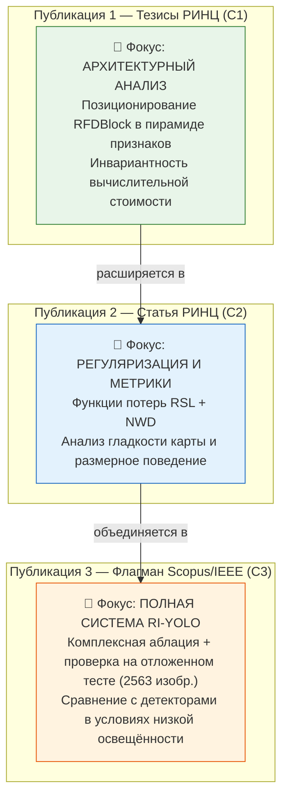

# RI-YOLO: Стратегия публикаций и техническая документация

---

## ШАГ 1. Оценка стратегии «Матрёшка»

### Статус: Стратегия легитимна и масштабируема

Публикация серии статей по проекту строится на разделении фокуса новизны, экспериментального базиса и целевой аудитории:
- Уникальный **фокус новизны** (architectural positioning vs. loss formulation vs. complete benchmark evaluation)
- Разная **глубина анализа**
- Разная **целевая аудитория**

### Разделение фокуса публикаций



### Критерии разграничения публикаций

| Критерий | Публикация 1 (Тезисы C1) | Публикация 2 (РИНЦ C2) | Публикация 3 (Scopus C3) |
|----------|-------------------------|------------------------|--------------------------|
| **Фокус** | Встраивание модуля в пирамиду признаков, TRF, FLOPs | Функции потерь RSL и NWD, поведение карты | Полный фреймворк, проверка обобщения на тесте |
| **Эксперименты** | Аблация позиций (P3, P4, pre-SPPF, post-SPPF, capctrl) | Сетка $\lambda_{tv}$, варианты NWD, профили градиентов | Полная 5-стадийная аблация, отложенный тест ExDark |
| **Глубина** | Архитектурные свойства и инвариантность стоимости | Математический анализ потерь и поведения карты | Системный анализ и сравнение |
| **Цитирование** | Первичная публикация | Цитирует C1 | Цитирует C1 и C2 |

---

## ШАГ 2. Русскоязычные статьи (РИНЦ)

---

### Публикация 1: Тезисы конференции (C1)

#### Название
**«Исследование влияния позиции блока модуляции признаков в архитектуре YOLOv8 на качество обнаружения объектов при слабом освещении»**

#### Аннотация

> В данной работе исследуется задача интеграции блока пространственной модуляции признаков, мотивированного теорией Retinex, на различных уровнях пирамиды признаков детектора YOLOv8s для задачи обнаружения объектов в условиях низкой освещённости.
>
> Обнаружение объектов при слабом освещении осложнено падением контрастности и высоким уровнем шума, что приводит к смешению информации об освещённости сцены и структуре объектов в свёрточных представлениях. Традиционные методы предобработки на основе модели Retinex вносят дополнительную задержку инференса.
>
> Исследуется встраивание блока Retinex Feature Modulation (RFDBlock) на четырёх уровнях тракта признаков: P3, P4, перед SPPF и после SPPF, а также в конфигурации контроля ёмкости (capctrl). Установлено, что вычислительная сложность инференса инвариантна к уровню встраивания и составляет 30,91 GFLOPs для всех позиций при шестнадцатикратном различии параметров блока (от 0,16M на P3 до 2,62M после SPPF). Прирост точности по mAP@50 относительно базовой модели находится в пределах статистической погрешности межзапусковой дисперсии (p = 0,096 по критерию Уэлча), а ранговая корреляция качества с теоретическим рецептивным полем составляет −0,05. Выученные значения масштабирующего коэффициента $\gamma \in [0,05; 0,08]$ соответствуют режиму слабого остаточного возмущения признаков.
>
> Эксперименты проведены на официальном разбиении бенчмарка ExDark (3000 обучающих, 1800 валидационных изображений).

---

### Публикация 2: Статья в сборнике/журнале РИНЦ (C2)

#### Название
**«Регуляризация обучения одностадийного детектора для условий низкой освещённости на основе гладкости карт модуляции и гауссовых метрик»**

#### Аннотация

> В работе исследуется комбинированная стратегия регуляризации обучения детектора объектов в условиях слабой освещённости. Рассматриваются два механизма: регуляризатор Retinex Smoothness Loss (RSL) на базе полной вариации (Total Variation) карты модуляции и гауссова метрика Normalized Wasserstein Distance (NWD).
>
> Анализ сетки коэффициентов регуляризации $\lambda_{tv} \in [10^{-4}, 10^{-1}]$ показал наличие широкой области нечувствительности: различия по средней точности между значениями сетки не превышают 1,7 стандартного межзапускового отклонения. Оценка пространственной корреляции карты модуляции $\mathbf{L}$ с физической яркостью входного изображения показывает околонулевые значения (ранговая корреляция Спирмена порядка −0,019), что свидетельствует о роли блока как структурного гейта, а не прямой декомпозиции физического поля освещённости. Применение NWD исследуется в режимах калибровки константы, масштабно-инвариантной нормализации и размерного гейтирования.

---

## ШАГ 3. Экспериментальный базис и дорожная карта (C3)

### 3.1 Датасет ExDark: официальное разбиение

Бенчмарк ExDark (Exclusively Dark) содержит 7363 изображения 12 классов объектов, снятых в условиях сумерек и ночи.
В проекте строго зафиксировано **официальное разбиение датасета**:

- **Обучающая выборка (train):** 3000 изображений (9731 аннотированный объект, средняя плотность 3,24 объекта на кадр).
- **Валидационная выборка (val):** 1800 изображений (5928 аннотированных объектов, средняя плотность 3,29 объекта на кадр).
- **Отложенная тестовая выборка (test):** 2563 изображения. Выборка не использовалась в процессе обучения, валидации, отбора чекпойнтов и калибровки гиперпараметров, что обеспечивает возможность независимой проверки обобщающей способности в C3.
- **Проверка пересечений:** Пересечение между списками `train` и `val` по именам файлов составляет строго 0 изображений. По содержимому (хэш MD5) обнаружены 3 совпадения ракурсов (0,16 % от валидационной выборки): `2015_03820 == 2015_03059`, `2015_04079 == 2015_07094`, `2015_06946 == 2015_03912`.

### 3.2 Результаты Фазы 1 (Аблация позиций и архитектурный анализ)

Фаза 1 исследовала встраивание RFDBlock на различных уровнях backbone YOLOv8s.

| Конфигурация | Слой встраивания | Масштаб признаков | Параметры блока, M | Вычислительная сложность, GFLOPs | TRF, px / % кадра | mAP@50 | mAP@50-95 | $\gamma_{final}$ |
|---|---|---|---:|---:|---:|---:|---:|---:|
| Baseline (YOLOv8s) | — | — | 0,00 | 28,6 | — | 0,6832 | 0,4228 | — |
| pos-p3 | 4 (P3/8) | 80×80 | 0,164 | 30,91 | 95 / 14,8 % | 0,6953 | 0,4327 | 0,076 |
| pos-p4 | 6 (P4/16) | 40×40 | 0,657 | 30,91 | 239 / 37,3 % | 0,6916 | 0,4328 | 0,058 |
| pos-presppf | 8 (P5/32) | 20×20 | 2,624 | 30,91 | 399 / 62,3 % | 0,6897 | 0,4334 | 0,051 |
| pos-postsppf | 10 (после SPPF) | 20×20 | 2,624 | 30,91 | 783 / 122,3 % | 0,6937 | 0,4348 | 0,050 |
| capctrl (Conv 3×3) | 10 (после SPPF) | 20×20 | 2,623 | 30,91 | 783 / 122,3 % | 0,6907 | 0,4348 | — |

#### Ключевые выводы по Фазе 1:

1. **Инвариантность вычислительной стоимости:**
   Несмотря на шестнадцатикратный рост числа параметров блока (с 0,164M на P3 до 2,624M на P5/SPPF), общая вычислительная сложность сети остаётся неизменной — **30,91 GFLOPs** для всех конфигураций. Это обусловлено тем, что уменьшение пространственного разрешения сетки ($80\times 80 \to 40\times 40 \to 20\times 20$) компенсирует квадратичный рост каналов при вычислении FLOPs.

2. **Независимость метрик от глубины встраивания:**
   Разброс значений mAP@50 между четырьмя позициями составляет 0,56 п.п. (от 0,6897 до 0,6953), что лежит внутри межзапусковой дисперсии (стандартное отклонение $\sigma = 0,26$ п.п.). Ранговая корреляция между теоретическим рецептивным полем (TRF) и качеством детекции составляет всего $-0,05$. Различие между RFD и базовой моделью по mAP@50 не достигает порога статистической значимости ($\alpha = 0,05$): критерий Уэлча даёт $t = 3,08, p = 0,096$. По mAP@50-95 различие значимо ($t = 5,44, p = 0,0057$), однако контроль ёмкости (`capctrl`) демонстрирует идентичный результат (0,4348 против 0,4348), что свидетельствует о преобладании эффекта добавления параметров над эффектом декомпозиции.

3. **Интерпретация обучаемого параметра $\gamma$:**
   Параметр $\gamma$, инициализированный нулём, стабилизируется в диапазоне $0,05 \dots 0,08$ во всех позициях. Это подтверждает, что блок функционирует в режиме малого остаточного возмущения латентных признаков, не нарушая устойчивость базовых предобученных представлений.

---

## ШАГ 4. Архитектура и функции потерь

---

### 4.1 RFDBlock — Блок модуляции признаков

#### 4.1.1 Мотивация и формулировка

Формулировка блока мотивирована классической моделью Retinex, разделяющей сигнал на медленно меняющуюся пространственную составляющую и высокочастотную детальную компоненту. В латентном пространстве сверточного представления блок выполняет пространственное гейтирование:

Пусть входной тензор $\mathbf{x} \in \mathbb{R}^{B \times C_1 \times H \times W}$.

1. **Проекция:**
   $$\mathbf{f} = \text{Conv}_{1 \times 1}(\mathbf{x}) \in \mathbb{R}^{B \times C_2 \times H \times W}$$
2. **Карта модуляции:**
   $$\mathbf{L} = \sigma\!\bigl(\text{Conv}_{1 \times 1}^{\text{gate}}(\mathbf{f})\bigr) \in \mathbb{R}^{B \times 1 \times H \times W}, \quad \mathbf{L} \in [0, 1]$$
3. **Структурная компонента:**
   $$\mathbf{S} = \text{Conv}_{3 \times 3}\!\bigl(\mathbf{f} \odot (1 - \mathbf{L})\bigr) \in \mathbb{R}^{B \times C_2 \times H \times W}$$
4. **Остаточное сложение (Identity Residual):**
   $$\mathbf{y} = \mathbf{x} + \gamma \cdot \mathbf{S}$$

где $\gamma$ — обучаемый скаляр, инициализируемый нулём (`gamma=0`). При инициализации выполняется строгое тождественное отображение $\mathbf{y} \equiv \mathbf{x}$.

*Примечание об эмпирической природе $\mathbf{L}$:* Экспериментально установлено, что карта $\mathbf{L}$ не образует статистически значимой корреляции с яркостью сцены ($r = -0,019$). Таким образом, $\mathbf{L}$ выступает обучаемой пространственной маской подавления/пропуска каналов, а не физической картой освещённости.

#### 4.1.2 Параметры блока для масштаба YOLOv8s

Для слоя после SPPF ($C_1 = C_2 = 512$):

| Компонент | Параметры |
|---|---|
| `cv1` (Conv $1 \times 1$ + BN + SiLU) | $512 \times 512 + 512 = 262\,656$ |
| `ill_estimator` (Conv $1 \times 1$, no bias) | $512 \times 1 = 512$ |
| `structure_conv` (Conv $3 \times 3$ + BN + SiLU) | $512 \times 512 \times 9 + 512 = 2\,360\,320$ |
| `gamma` (скаляр) | 1 |
| **Всего в RFDBlock** | **2,623,489 (~2.62M)** |

---

### 4.2 Retinex Smoothness Loss (RSL)

#### 4.2.1 Математическая формулировка

Регуляризатор накладывает штраф на полную вариацию (Total Variation) карты $\mathbf{L}$:

$$\mathcal{L}_{\text{RSL}} = \frac{1}{(H-1)W}\sum_{i=1}^{H-1}\sum_{j=1}^{W} |\mathbf{L}_{i+1, j} - \mathbf{L}_{i, j}| + \frac{1}{H(W-1)}\sum_{i=1}^{H}\sum_{j=1}^{W-1} |\mathbf{L}_{i, j+1} - \mathbf{L}_{i, j}|$$

Общая функция потерь при обучении:
$$\mathcal{L}_{\text{total}} = \mathcal{L}_{\text{box}} + \mathcal{L}_{\text{cls}} + \mathcal{L}_{\text{dfl}} + \lambda_{\text{tv}} \cdot \mathcal{L}_{\text{RSL}} \cdot B$$

где $B$ — размер батча.

---

### 4.3 Normalized Wasserstein Distance (NWD)

#### 4.3.1 Формулировка метрики

Для двух рамок, аппроксимируемых 2D-гауссианами с центрами $(c_{x1}, c_{y1}), (c_{x2}, c_{y2})$ и размерами $(w_1, h_1), (w_2, h_2)$:

$$W_2^2 = (c_{x1} - c_{x2})^2 + (c_{y1} - c_{y2})^2 + \frac{(w_1 - w_2)^2 + (h_1 - h_2)^2}{4}$$

Нормализация в сходство:
$$\text{NWD} = \exp\!\left(-\frac{W_2}{C}\right) \in (0, 1]$$

Комбинирование потерь локализации:
$$\mathcal{L}_{\text{box}} = \alpha \cdot (1 - \text{NWD}) + (1 - \alpha) \cdot (1 - \text{CIoU})$$

В режиме размерного гейтирования (`sizegate`):
$$\alpha = \left(\alpha_0 \cdot \exp\left(-\frac{\sqrt{w \cdot h}}{\tau_{\text{size}}}\right)\right)$$
с обязательным согласованием размерностей через `.unsqueeze(-1)` для соответствия форме вектора $\text{IoU} \in [N, 1]$.

---

### 4.4 Архитектурное встраивание и перепривязка весов

Встраивание блока слоем 10 (после SPPF) сдвигает последующие слои детектора на $+1$.
В модуле `tasks.py` реализована автоматическая перепривязка предобученных весов:

```python
has_rfd = any(m.__class__.__name__ == "RFDBlock" for m in self.model.modules())
if has_rfd and not any("10.structure_conv" in k for k in csd.keys()):
    for k, v in csd.items():
        # Сдвиг индексов слоев Head (model.10.* -> model.11.*)
        if parts[1].isdigit() and int(parts[1]) >= 10:
            remapped_csd[f"model.{idx + 1}.{rest}"] = v
```

Это гарантирует перенос весов backbone (слои 0–9) и слоев Head (11–23) со случайной инициализацией нового блока (слой 10).
